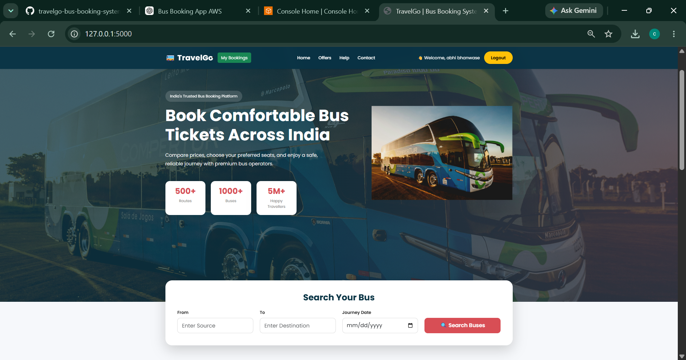
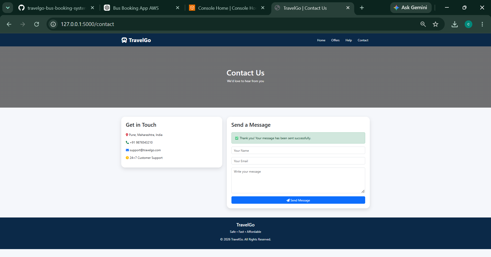

# 🚌 TravelGo -- Bus Booking System


------------------------------------------------------------------------

# 🚀 Project Overview

TravelGo is a full-stack Bus Booking Web Application developed using
**Python, Flask, PostgreSQL, HTML, CSS, Bootstrap, and JavaScript**.

The application enables users to register, log in securely, search
buses, select seats, complete bookings, manage reservations, cancel
bookings, and contact customer support.

The project is designed with a modular architecture and is ready for
deployment on **AWS EC2 with PostgreSQL**.

------------------------------------------------------------------------

# ❗ Business Problem

Traditional ticket booking systems often require customers to visit
ticket counters or use disconnected services. They may lack real-time
seat management, booking history, and online support.

## ✅ Solution

TravelGo provides an online booking platform that allows users to:

-   Register and Login
-   Search buses by route
-   View bus details
-   Select available seats
-   Book tickets online
-   Manage bookings
-   Cancel bookings
-   Contact customer support

------------------------------------------------------------------------

# 🏗️ Application Architecture

``` text
User
   │
   ▼
Frontend (HTML • CSS • Bootstrap)
   │
   ▼
Flask Application
   │
   ▼
PostgreSQL Database
   │
   ├── Users
   ├── Buses
   ├── Seats
   ├── Bookings
   ├── Booking Passengers
   └── Contact Messages
```

------------------------------------------------------------------------

# 🔄 Application Workflow

1.  User Registration
2.  User Login
3.  Search Buses
4.  View Bus Details
5.  Select Seats
6.  Enter Passenger Details
7.  Payment
8.  Booking Confirmation
9.  View My Bookings
10. Cancel Booking
11. Contact Support

------------------------------------------------------------------------

# ✨ Features

-   Secure User Authentication
-   Bus Search
-   Bus Details
-   Dynamic Seat Selection
-   Passenger Management
-   Booking Confirmation
-   My Bookings
-   Cancel Booking
-   Contact Us Form
-   PostgreSQL Database
-   Responsive Design

------------------------------------------------------------------------

# 🗄️ Database Tables

-   users
-   buses
-   seats
-   bookings
-   booking_passengers
-   contact_messages

------------------------------------------------------------------------

# 🛠️ Technologies Used

## Backend

-   Python
-   Flask

## Frontend

-   HTML5
-   CSS3
-   Bootstrap 5
-   JavaScript

## Database

-   PostgreSQL

## Version Control

-   Git
-   GitHub

## Cloud (Planned)

-   AWS EC2
-   Amazon RDS
-   Nginx
-   Gunicorn

------------------------------------------------------------------------

# 📂 Project Structure

``` text
travelgo-bus-booking-system/
│
├── backend/
│   ├── app.py
│   ├── config.py
│   ├── requirements.txt
│   ├── templates/
│   └── static/
│
└── README.md
```

------------------------------------------------------------------------

## 📸 Project Screenshots

### 🏠 Home Page



---

### 💺 Seat Selection


---

### 🎟️ Booking Confirmation


---

### 📖 My Bookings


---

### 📞 Contact Us



------------------------------------------------------------------------

# 🚀 Installation

``` bash
git clone https://github.com/chaitanyagurav59-byte/travelgo-bus-booking-system.git

cd travelgo-bus-booking-system/backend

pip install -r requirements.txt

python app.py
```

------------------------------------------------------------------------

# 🌐 Usage

1.  Register an account
2.  Login
3.  Search buses
4.  Select a bus
5.  Choose seats
6.  Enter passenger details
7.  Confirm booking
8.  View My Bookings
9.  Contact support

------------------------------------------------------------------------

# 🔮 Future Enhancements

-   Admin Dashboard
-   Amazon SES Email Notifications
-   Razorpay Integration
-   PDF Ticket Generation
-   AWS EC2 Deployment
-   Amazon RDS
-   Docker
-   CI/CD Pipeline
-   Live Bus Tracking

------------------------------------------------------------------------

# 📚 Skills Learned

-   Flask Web Development
-   PostgreSQL Database Design
-   Session Management
-   SQL
-   HTML/CSS/Bootstrap
-   CRUD Operations
-   Git & GitHub
-   Cloud Deployment Preparation

------------------------------------------------------------------------

# 🌍 Real-World Applications

-   Online Bus Booking Platforms
-   Railway Reservation Systems
-   Airline Ticket Booking
-   Event Ticketing Systems
-   Travel Management Applications

------------------------------------------------------------------------

# 📊 Project Outcome

Successfully developed a complete bus booking application with:

-   User Authentication
-   Online Seat Booking
-   Booking Management
-   Contact Support
-   Relational Database Design
-   Responsive User Interface

------------------------------------------------------------------------

# 👨‍💻 Author

**Chaitanya Gurav**

GitHub: https://github.com/chaitanyagurav59-byte

------------------------------------------------------------------------

# 📄 License

This project is intended for educational and portfolio purposes.
